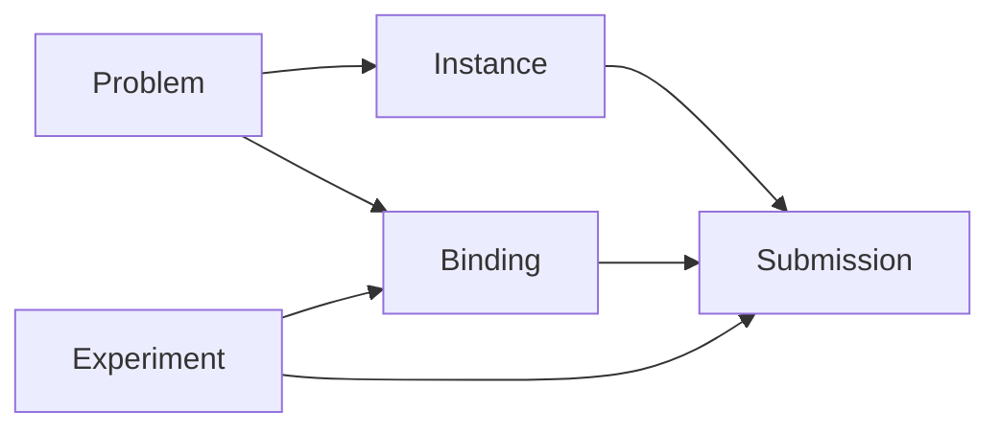

<!--
Copyright IBM Corporation 2026
SPDX-License-Identifier: Apache-2.0
-->

# Benchmarks

With Algorithm Nexus you can add benchmark problems, instances, experiments, and
submissions as separate artifacts.

* A **benchmark problem** is the abstract task.
* A **benchmark instance** is one concrete realisation of that task.
* A **benchmark experiment** is a `ado` experiment that evaluates a **benchmark target** (an algorithm or model).
* A **benchmark experiment package** is a python package containing one or more **benchmark experiments**.
* A **benchmark binding** maps a benchmark experiment's property and metric names onto the problem's.
* A **benchmark submission** applies one benchmark experiment to one benchmark instance for one benchmark target.

## Contribute a problem or instance

* *I want to add a new benchmark problem:*
    * No pre-requisites. Go straight to [contributing a benchmark problem](add_benchmark_problem.md)
* *I want to add a new benchmark instance:*
    * The benchmark problem class needs to be defined first. [Contributing a benchmark problem and instance](add_benchmark_problem.md)
  walks through both steps

## Contribute a benchmark experiment or benchmark submission

* *I want to add a new benchmark experiment:*
    * No pre-requisites. Go straight to [contributing a benchmark experiment package](add_benchmark_experiment.md)
* *I want to add a new submission*
    * The [benchmark problem and instance](add_benchmark_problem.md) must be already defined
    * The [benchmark experiment package with the benchmark experiment must be added](add_benchmark_experiment.md)
    * There must be a [binding from the benchmark experiment to the benchmark problem](add_benchmark_binding.md)
    * If all above are in place follow [making a benchmark submission](add_benchmark_submission.md)

## Details

The following diagram shows the relationship between the benchmark pieces:

## See also

* [Logical Benchmarks and Instances](../../design/benchmarking/logical_benchmarks_and_instances.md)
* [Benchmark Experiments and Submissions](../../design/benchmarking/benchmark_experiments_and_submissions.md)
* [Benchmark Execution and Operations](../../design/benchmarking/benchmark_execution.md)
